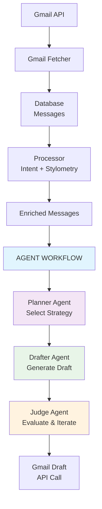

# ReplyRobin 
### AI-powered email sidekick that learns from your inbox

ReplyRobin is an intelligent email assistant that quietly learns from your inbox patterns and generates contextually appropriate draft responses. No complex integrations needed - just set it up once and let it learn from your communication style.

ReplyRobin analyzes past conversations and your linguistic patterns to generate drafts that sound authentically like you.

## Core Components

### 📅 Scheduled Jobs
- **Fetcher**: Retrieves latest email threads from Gmail API into database
- **Processor**: Enriches messages with stylometry analysis and intent classification
- **Reply**: Generates replies

### 🤖 Agent Orchestration System
- **Master Agent**: Orchestrates and manages the entire workflow
- **Planner Agent**: Analyzes context and plans draft strategy
- **Drafter Agent**: Generates drafts using contextual email history and user's linguistic profile
- **Judge Agent**: Evaluates draft quality and iterates for improvement

### 🎯 Evaluation Engine
- **Comprehensive testing framework** for agent workflows
- **LLM-as-judge evaluation** for draft quality assessment
- **Trajectory validation** to ensure proper agent execution flow

## Architecture



## Data Flow Architecture

```
  ┌─────────────────┐    ┌─────────────────┐    ┌─────────────────┐
  │   Gmail API     │───▶│   Gmail Fetcher │───▶│   Database      │
  │                 │    │                 │    │   (Messages)    │
  └─────────────────┘    └─────────────────┘    └─────────────────┘
                                                          │
                                                          ▼
  ┌─────────────────┐    ┌─────────────────┐    ┌─────────────────┐
  │   Enriched      │◀───│   Processor     │◀───│   Raw Messages  │
  │   Messages      │    │   (Intent +     │    │                 │
  │                 │    │   Stylometry)   │    │                 │
  └─────────────────┘    └─────────────────┘    └─────────────────┘
           │
           ▼
  ┌─────────────────────────────────────────────────────────────────┐
  │                    AGENT WORKFLOW                              │
  │                                                                 │
  │  ┌─────────────┐   ┌─────────────┐   ┌─────────────┐          │
  │  │   Planner   │──▶│   Drafter   │──▶│    Judge    │          │
  │  │   Agent     │   │   Agent     │   │   Agent     │          │
  │  └─────────────┘   └─────────────┘   └─────────────┘          │
  │         │                  │                  │               │
  │         ▼                  ▼                  ▼               │
  │  Select Strategy    Generate Draft    Evaluate & Iterate      │
  └─────────────────────────────────────────────────────────────────┘
                                  │
                                  ▼
                      ┌─────────────────┐
                      │  Gmail Draft    │
                      │   (API Call)    │
                      └─────────────────┘
```

## Setup

If you want to use this on your inbox and in your hosted environment - welcome! It will take about 10 minutes.

**Step 1**: Head over to Google Cloud and enable the Gmail API

## Commands

```bash
# Run the application
make run

# Format code
make format

# Run database migrations
make migrate

# Run evaluations
make eval              # Normal mode (shows only failures)
make eval-verbose      # Verbose mode (shows all test details)
make eval-help         # Show evaluation help
```

## 🎯 Evaluation Engine

ReplyRobin includes a comprehensive evaluation framework to ensure the quality and reliability of generated email drafts.

### Overview

The evaluation engine (`evals/base_eval.py`) provides a flexible framework for testing agent workflows with:

- **Trajectory Validation**: Ensures agents follow expected execution paths
- **Draft Quality Assessment**: Uses LLM-as-judge to evaluate response quality
- **Subsequence Matching**: Allows flexible trajectory validation (expected steps can be a subsequence of actual steps)
- **Minimal Output**: Clean test reporting with detailed failure information

### Base Evaluation Framework

The `BaseEval` class provides the foundation for all evaluations:

```python
from evals.base_eval import BaseEval

class MyCustomEval(BaseEval):
    def __init__(self, verbose: bool = False):
        super().__init__("My Custom Evaluation", verbose=verbose)
    
    def get_examples(self) -> List[Dict[str, Any]]:
        """Return test examples with inputs/outputs"""
        return [
            {
                "test_name": "descriptive_test_name",
                "inputs": {
                    "character_profile": profile,
                    "current_email": email,
                    "past_emails": past_emails
                },
                "outputs": {
                    "final_draft": "expected draft text",
                    "trajectory": ["planner", "drafter", "judge"]
                }
            }
        ]
    
    def get_grader_instructions(self) -> str:
        """Return LLM judge instructions for this evaluation type"""
        return "Instructions for evaluating this specific use case..."
```

### Key Features

#### 1. **Trajectory Validation**
- Uses subsequence matching instead of exact matching
- Expected trajectory: `["planner", "drafter"]`
- Actual trajectory: `["planner", "drafter", "judge"]` → ✅ **PASSES**
- Allows agents to take additional steps while ensuring core workflow is followed

#### 2. **LLM-as-Judge Evaluation**
- Compares actual vs expected draft outputs
- Focuses on content similarity and meaning
- Skips LLM evaluation when no draft is expected (e.g., spam emails)

#### 3. **Smart Output Modes**

**Normal Mode** (`make eval`):
```
🔄 Running evaluations...
CustomerSupport.spam_email_no_reply ✅
CustomerSupport.insufficient_context_response ❌
CustomerSupport.account_lockout_support ✅

Tests: 2/3 passed

❌ FAILURES:
CustomerSupport.insufficient_context_response:
  Subject: Help needed...
  - Draft quality failed
  - DRAFT_QUALITY: NO - Content differs significantly...
```

**Verbose Mode** (`make eval-verbose`):
- Shows full test details, reasoning, and statistics
- Exports results to CSV for analysis
- Displays comprehensive failure information

### Adding New Evaluations

1. **Create your evaluation class** in `evals/`:

```python
# evals/my_evaluation.py
from evals.base_eval import BaseEval

class MyEvaluationEval(BaseEval):
    def __init__(self, verbose: bool = False):
        super().__init__("My Evaluation Dataset", verbose=verbose)
    
    def get_examples(self):
        return [
            {
                "test_name": "meaningful_test_name",
                "inputs": {
                    "character_profile": create_test_profile(),
                    "current_email": Email(...),
                    "past_emails": [...]
                },
                "outputs": {
                    "final_draft": "Expected response text",
                    "trajectory": ["expected", "agent", "steps"]
                }
            }
        ]
    
    def get_grader_instructions(self):
        return "Custom evaluation criteria for your use case..."
```

2. **Update the evaluation runner** in `evals/eval.py`:

```python
from evals.my_evaluation import MyEvaluationEval

async def run_my_evaluation(verbose: bool = False):
    runner = GenericEvaluationRunner(MyEvaluationEval, verbose=verbose)
    return await runner.run_evaluation()
```

### Customer Support Evaluation Example

The included `CustomerSupportEval` demonstrates best practices:

- **Test Cases**:
  - `spam_email_no_reply`: Ensures spam emails receive no response
  - `insufficient_context_response`: Tests handling of vague requests
  - `account_lockout_support`: Validates proper customer support responses

- **Character Profile**: Realistic customer support agent linguistic patterns
- **Expected Trajectories**: Flexible workflow validation
- **Draft Quality**: LLM-based similarity assessment

### Evaluation Metrics

- **Pass/Fail**: Simple binary result per test
- **Trajectory Correctness**: Agent workflow validation  
- **Draft Quality**: Content similarity assessment
- **Pass Rate**: Overall evaluation success percentage

The evaluation engine ensures ReplyRobin consistently generates high-quality, contextually appropriate email drafts while maintaining the expected agent workflow patterns.